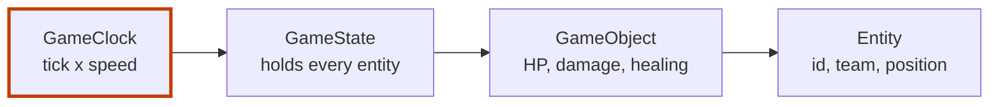

# LoL Simulated Laning Environment (`lol_sim_env`)

[](https://www.python.org/)
[](LICENSE)

**The first layer of a fast, headless League of Legends bot-lane simulator for training a Taric agent with reinforcement learning.**

An RL agent learns by playing thousands of games, and one real game takes about half an hour.
A simulator can play the lane faster than real time, with no screen, on a cloud GPU.
This repo holds the first layer of that simulator: a game clock with a speed multiplier, and game objects that take damage and heal.

- **What exists:** four core classes (`Entity`, `GameObject`, `GameClock`, `GameState`) and one settings file, `simulation_params.yaml`.
- **What does not:** the Gymnasium environment, Taric, minions, turrets and abilities. `src/envs/` is empty.
- **Where the rest is described:** [`docs/lol_sim_env.md`](docs/lol_sim_env.md) plans the build task by task; tasks 1.1.1 to 1.1.6 are marked done.

Personal project, 2025. Part of **Project Taric**, four repos with one goal, an AI that plays Taric:

| Repo | Part | What exists |
|---|---|---|
| [Taric_Bot_Data](https://github.com/Estaed/Taric_Bot_Data) | The author's own Taric games | Riot API collection and feature scripts |
| [Lol_Data_MCP_Server](https://github.com/Estaed/Lol_Data_MCP_Server) | Game data for the other parts | A working MCP server with 9 tools |
| **Lol_Sim_Env** (this repo) | The training lane for RL | Core game classes |
| [Taric_AI_Agent](https://github.com/Estaed/Taric_AI_Agent) | The agent (IL + RL) | Design documents |

## Quick start

```bash
git clone https://github.com/Estaed/Lol_Sim_Env.git
cd Lol_Sim_Env
pip install -e .
```

The package installs `game_logic` and `configs` from `src/`. This script uses the core classes:

```python
from game_logic.core import GameClock, GameObject, GameState

clock = GameClock(tick_duration=0.1, game_speed_multiplier=2.0)
state = GameState(clock)

taric = GameObject("taric", team_id=0, position=[200, 200], radius=1.0,
                   base_stats={"hp": 600, "max_hp": 600})
state.add_entity(taric)

taric.take_damage(300)
print(taric.heal(500), taric.stats["hp"])   # 300 600  (healing stops at max HP)
clock.tick()
print(clock.current_time)                   # 0.2      (0.1 s tick at 2x speed)
```

## How it works



1. **`GameClock`** moves time forward by `tick_duration x game_speed_multiplier` on each tick. The default is 0.1 s at 1x speed. A higher multiplier is how training runs faster than real time.
2. **`GameState`** keeps every entity in one dictionary. It also sorts them into champions, minions, turrets and projectiles by class name, and can list all entities of one team.
3. **`GameObject`** adds stats to an entity. `take_damage` stops HP at 0 and `heal` stops it at `max_hp`. Armor and magic resist are not applied in this version.
4. **`Entity`** is the base: an id, a team, a 2D position and a collision radius.

<details>
<summary>Settings in <code>simulation_params.yaml</code></summary>

No code reads this file in this version. It holds the numbers the simulator is set up with.

| Setting | Value |
|---|---|
| Lane size | 1000 x 400 simulation units |
| Tick | 0.1 s (10 FPS), speed multiplier 1.0 |
| Episode length | 900 s (15 min); 60 s for MVP tests |
| Champions | 500 starting gold, level 1 to 18, 10 s base respawn |
| Gold | 2 per second passive, 21 per minion, 300 per champion kill, 100 first blood bonus |
| XP | 29 per minion, 400 per champion kill, assists get half |
| Minion waves | every 30 s, 6 minions, a siege minion every 3rd wave, +2% stats per minute |
| Taric | starts at (200, 200); ability haste cap 0.67 |
| Items | sell back for 70% of the price |
| Scripted AI | 0.2 s reaction time, aggression 0.5 |
| Rendering | `text` by default; `human` and `rgb_array` modes named |

</details>

<details>
<summary>The design target (from <code>docs/lol_sim_env.md</code>)</summary>

The specification describes a lightweight Python simulation of the 2v2 bot-lane laning phase. It puts game mechanics before visuals, runs headless, and follows the Gymnasium interface.

- **Duration:** up to 15 minutes of game time.
- **Agent:** Taric (support) with his full kit (Q, W, E, R).
- **Scripted ally:** an ADC of a configurable archetype.
- **Scripted enemies:** two configurable enemy archetypes.
- **Game elements:** minions, turrets, items, gold and XP.
- **Data:** stats from the [League of Legends Wiki](https://wiki.leagueoflegends.com/en-us/) and [Riot Data Dragon](https://developer.riotgames.com/docs/lol#data-dragon). Phase 1.5 of the plan fetches them from the [LoL Data MCP Server](https://github.com/Estaed/Lol_Data_MCP_Server) instead. The repo has no MCP client code.

[`docs/Architecture_env.md`](docs/Architecture_env.md) shows the full file structure the design aims for.

**Cursor settings.** For League of Legends context while coding, open Cursor Settings, then `Cursor: Docs`. Add the League of Legends Wiki and the Riot Developer Portal as documentation sources, and enable indexing for champion and item terms.

</details>

---

Lol_Sim_Env is not endorsed by Riot Games. League of Legends is a trademark of Riot Games, Inc.
